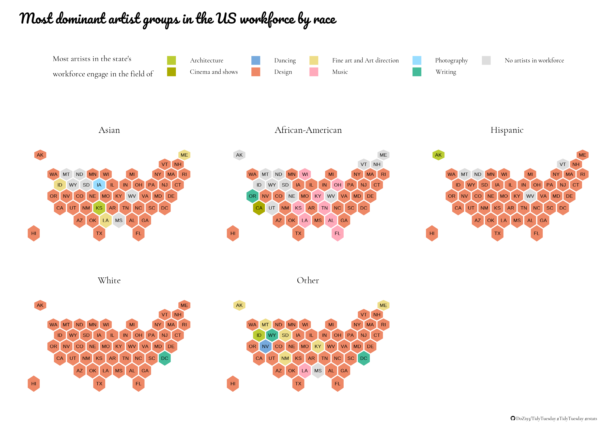
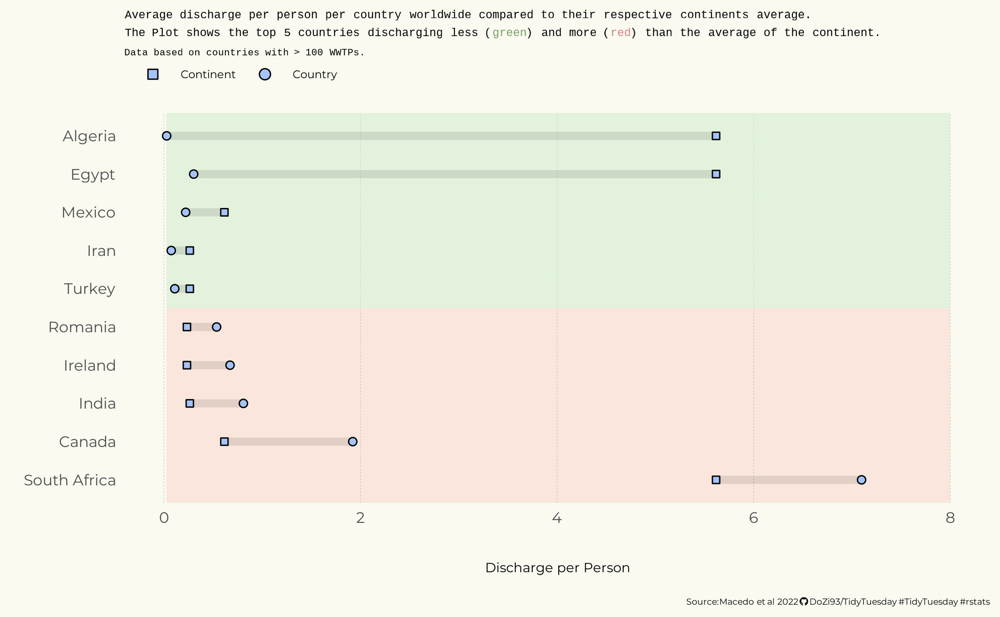

# TidyTuesday
Repository for the up and coming TidyTuesday challenges set by the absolutely amazing fordatascience/tidytuesday. #TidyTuesday

## Submissions for the different weeks

### Week 39
This weeks dataset was all about the artists in the workforce of the US. Since I wanted to always use the geom_polygon function  
together to show "factorial" semi-spatial data (US states for example), I decided to color the different states based on which artist field  
had the highest numbers in the artist workforce. Since I was interested in differences between different ethnicities, I faceted across race.

### Week 38
Provided was a dataset on wastewater treatment plants worldwide, their dilution levels, the people they serve and the amount of discharge.

